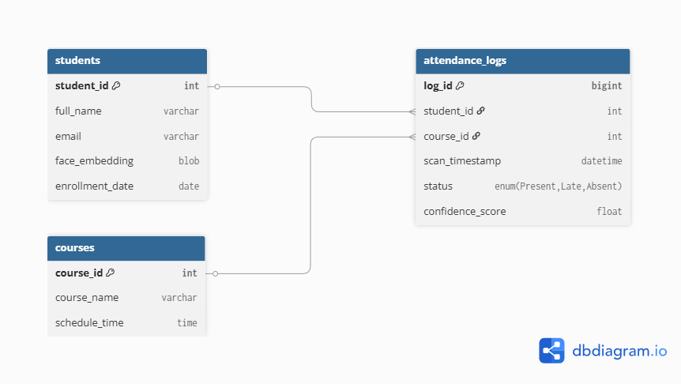

<div align="center">
  <a href="SQL_SCENARIOS.md">
    
  </a>
  <p><em>Click the banner to view the full analysis report</em></p>
</div>

# 🛡️ Attendance DB Core (Performance & Optimization)


## 📌 Overview
This project focuses on the **backend database engineering** required for a high-traffic Face Recognition Attendance System. 

Instead of focusing on the AI model, this repo demonstrates:
1.  **Schema Design:** Normalized tables for students and logs.
2.  **Data Simulation:** Python scripts to generate 100,000+ realistic attendance records.
3.  **Performance Tuning:** Demonstrating how **Composite Indexes** reduce query time from massive scans to instant lookups.

---

## 🏗️ Database Schema


* **Students:** Stores identity and vector placeholders.
* **AttendanceLogs:** High-volume transactional table (Write-Heavy).
* **Courses:** Metadata for class schedules.


---

## ⚡ Performance Optimization Showcase
The critical part of this project is demonstrating **Indexing Strategies**.

### The Problem (Full Table Scan)
When querying for a single student's monthly logs without an index, MySQL scans the entire dataset.
* **Rows Scanned:** ~100,000
* **Query Time:** Slow (increases with data volume)

### The Solution (Composite Index)
We implemented a composite index on `(student_id, scan_timestamp)`.
```sql
CREATE INDEX idx_student_time ON attendance_logs(student_id, scan_timestamp);
```
---
📄 **[View Full Analysis Report](https://htmlpreview.github.io/?https://github.com/sanaurrehmanarain/FaceRecog-DB-Core-SQL/blob/main/SQL_SCENARIOS.md)**
---