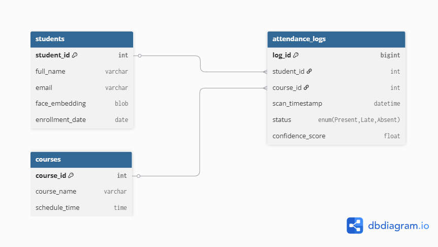

<div align="center">
  <a href="SQL_SCENARIOS.md">
    
  </a>
  <p><em>Click the banner to view the full analysis report</em></p>
</div>

# 🛡️ Attendance DB Core (Performance & Optimization)


## 📌 Overview
This project focuses on the **backend database engineering** required for a high-traffic Face Recognition Attendance System. 

Instead of focusing on the AI model, this repo demonstrates:
1.  **Schema Design:** Normalized tables for students and logs.
2.  **Data Simulation:** Python scripts to generate 100,000+ realistic attendance records.
3.  **Performance Tuning:** Demonstrating how **Composite Indexes** reduce query time from massive scans to instant lookups.

---

## 🏗️ Database Schema


* **Students:** Stores identity and vector placeholders.
* **AttendanceLogs:** High-volume transactional table (Write-Heavy).
* **Courses:** Metadata for class schedules.


---

## ⚡ Performance Optimization Showcase
The critical part of this project is demonstrating **Indexing Strategies**.

### The Problem (Full Table Scan)
When querying for a single student's monthly logs without an index, MySQL scans the entire dataset.
* **Rows Scanned:** ~100,000
* **Query Time:** Slow (increases with data volume)

### The Solution (Composite Index)
We implemented a composite index on `(student_id, scan_timestamp)`.
```sql
CREATE INDEX idx_student_time ON attendance_logs(student_id, scan_timestamp);
```

## Citation

If you use this project in academic research, publications, educational
materials, or derivative works, please cite the project.

This repository includes a `CITATION.cff` file, so GitHub provides a
**"Cite this repository"** button in the repository sidebar. You can use it
to obtain citations in BibTeX, APA, and other supported formats.

**Suggested citation:**

Arain, S. U. R. (2026). FaceRecog-DB-Core-SQL (Version 1.0) [Software].
<https://github.com/sanaurrehmanarain/FaceRecog-DB-Core-SQL>

**Author:** Sana Ur Rehman Arain

**Profession:** Data Scientist

**GitHub:** <https://github.com/sanaurrehmanarain>

**Contact:** <sana.arain.work@gmail.com>

If you build upon this work, attribution is appreciated and helps others
discover the original project.

> **Note:** The MIT License requires that the original copyright
> notice be retained in copies of the Software.

---

## License

This project is licensed under the MIT License. See the
[LICENSE](LICENSE) file for details.
