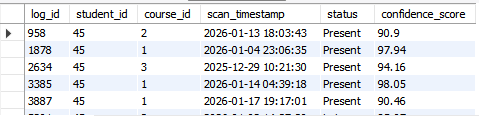
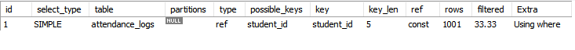
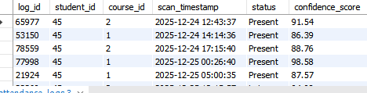
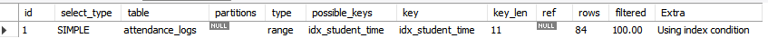
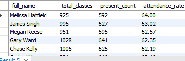
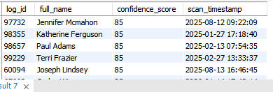

# ⚡ SQL Scenarios & Performance Lab

This document records the optimization experiments and analytical queries executed on the `attendance_db` database.

---

## 🔬 Part 1: The Performance Lab

**Objective:** Demonstrate how indexing transforms query speed on large datasets (100k+ rows).

### 1. The "Slow" Query (Before Optimization)

**Scenario:** An admin wants to view the history of a specific student (`student_id = 45`) for the past month.

**Observation:** Without an index, the database performs a **Full Table Scan**, checking every single row in the logs.
```sql
SELECT * FROM attendance_logs 
WHERE student_id = 45 
AND scan_timestamp > DATE_SUB(NOW(), INTERVAL 1 MONTH);
```

**Output / Time Taken:**



---

### 2. Diagnosis (EXPLAIN Command)

**Scenario:** Using the `EXPLAIN` keyword to reveal what MySQL is doing behind the scenes.

**Observation:** Look at the `rows` column in the result. It likely scans ~100,000 rows.
```sql
EXPLAIN SELECT * FROM attendance_logs 
WHERE student_id = 45 
AND scan_timestamp > DATE_SUB(NOW(), INTERVAL 1 MONTH);
```

**Output (Note the 'rows' count):**



---

### 3. The Fix (Applying the Index)

**Scenario:** We create a Composite Index on `student_id` and `scan_timestamp`. This organizes the data essentially like a phone book, allowing instant lookups.
```sql
CREATE INDEX idx_student_time ON attendance_logs(student_id, scan_timestamp);
```

---

### 4. The "Fast" Query (After Optimization)

**Scenario:** Running the exact same query from Step 1 again.

**Observation:** The execution time should drop to nearly 0.00 seconds.
```sql
SELECT * FROM attendance_logs 
WHERE student_id = 45 
AND scan_timestamp > DATE_SUB(NOW(), INTERVAL 1 MONTH);
```

**Output / Time Taken:**



---

### 5. Proof of Speed (EXPLAIN After Fix)

**Scenario:** Verifying the improvement.

**Observation:** The `rows` column should drop from ~100,000 to < 50. The `key` column will now show `idx_student_time`.
```sql
EXPLAIN SELECT * FROM attendance_logs 
WHERE student_id = 45 
AND scan_timestamp > DATE_SUB(NOW(), INTERVAL 1 MONTH);
```

**Output (Note the drastic drop in 'rows'):**



---

## 📊 Part 2: Business Analytics

**Objective:** Standard reporting queries used by the Attendance System Dashboard.

### 6. Student Attendance Rate

**Scenario:** Calculate the percentage of classes attended for each student.
```sql
SELECT 
    s.full_name,
    COUNT(*) AS total_classes,
    SUM(CASE WHEN a.status = 'Present' THEN 1 ELSE 0 END) AS present_count,
    ROUND(SUM(CASE WHEN a.status = 'Present' THEN 1 ELSE 0 END) / COUNT(*) * 100, 2) AS attendance_rate
FROM attendance_logs a
JOIN students s ON a.student_id = s.student_id
GROUP BY s.student_id
ORDER BY attendance_rate DESC
LIMIT 10;
```

**Output:**



---

### 7. The "Habitual Latecomers" Report

**Scenario:** Identify students who have been late more than 5 times.
```sql
SELECT s.full_name, COUNT(*) as late_count
FROM attendance_logs a
JOIN students s ON a.student_id = s.student_id
WHERE a.status = 'Late'
GROUP BY s.student_id
HAVING late_count > 5
ORDER BY late_count DESC;
```

**Output:**


---

### 8. Low Confidence Detections (AI Monitor)

**Scenario:** Find records where the AI was less than 90% sure of the face match. This helps identify hardware issues or lighting problems.
```sql
SELECT 
    l.log_id,
    s.full_name,
    l.confidence_score,
    l.scan_timestamp
FROM attendance_logs l
JOIN students s ON l.student_id = s.student_id
WHERE l.confidence_score < 90.0
ORDER BY l.confidence_score ASC
LIMIT 10;
```

**Output:**

